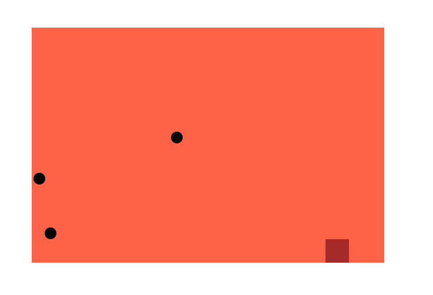
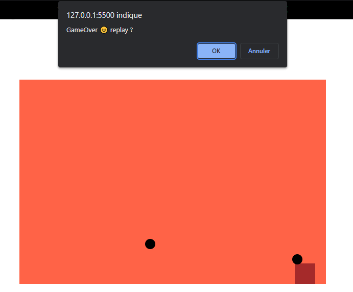

# Bouncing div side to side with drops 
This is a JavaScript code to practice some functionality


- ## Bouncing div side to side
The brown div will bounce infinity inside the tomato (red) div

- ## drops
Some dotes will fall down like rain, to increase the number of dotes :
change this line:
```
function timer() {
    move("car");
    if(Math.random()<0.005){// <= **change this value to have more drops**
        rain();
    }
    if (document.getElementById('drop')) {
        dropRain();
    }else{
        rain();
    }
    my_time = setTimeout('timer()', 10);
}
```
the higher the number, the more dots you will get.

## screenshots
<br/>
<br/>
When GameOver<br/>
<br/><br/>


If you found that useful, don't forget to give a ⭐ *Good luck*
